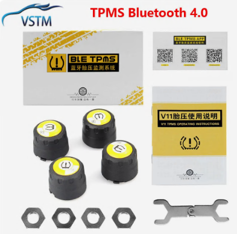
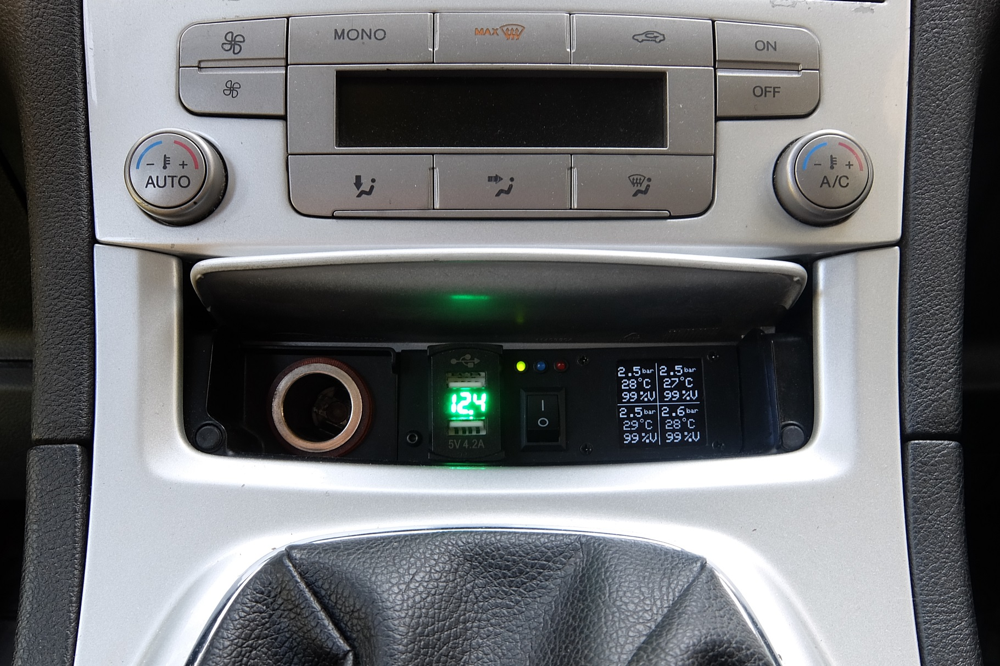

# Ford_TPMS
TPMS system with ESP32 for my ford galaxy.

Works with BT sensors v4.0 like that: https://aliexpress.ru/item/1005002518896680.html

  

BT server name in ESP32 = "Ford_TPMS_CFG". Connect to it with smartphone. Use app "Serial Bluetooth Terminal" to send next commands:
<ul>
<li>R1\n - read BLE address of front left TPMS sensor</li>
<li>R2\n - read BLE address of front right TPMS sensor</li>
<li>R3\n - read BLE address of rear left TPMS sensor</li>
<li>R4\n - read BLE address of rear right TPMS sensor</li>
<li>A1=12:34:56:78:9a:bc\n - set BLE address of front left TPMS sensor</li>
<li>A2=12:34:56:78:9a:bc\n - set BLE address of front right TPMS sensor</li>
<li>A3=12:34:56:78:9a:bc\n - set BLE address of rear left TPMS sensor</li>
<li>A4=12:34:56:78:9a:bc\n - set BLE address of rear right TPMS sensor</li>
</ul>

Result:

 

